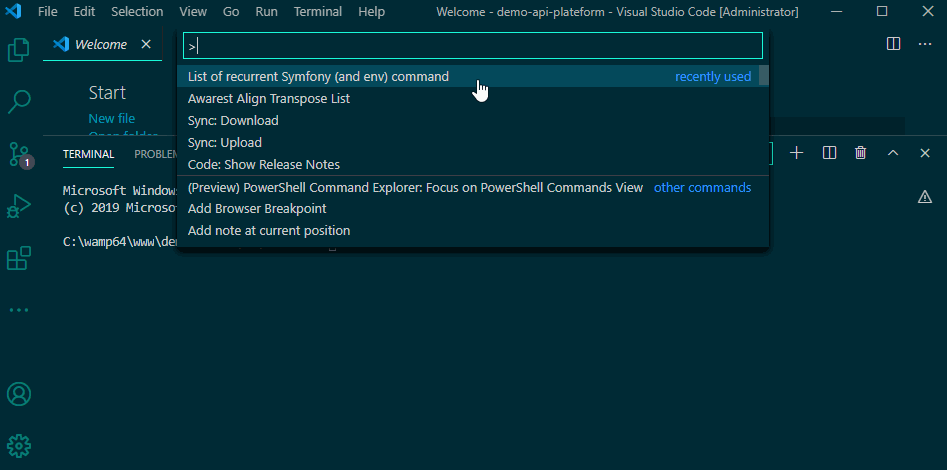

# Lorc List of recurrent Symfony command

Run more than 200 terminal commands for Symfony/composer from command palette with search box.

## See how it works

## Features

- Symfony.exe (110+ commands)
- Symfony (2, 3, 4, 5) project (php bin/console ...) (80+ commands)
- Composer (50+ commands)
- Install recurrent symfony bundle (like apiplatform or profiler)

## Installation

Install this extension from the [VSCode Marketplace](https://marketplace.visualstudio.com/items?itemName=jeromeDiaz.lorc)

## Todo

- ✔️ ~~if no terminal is active, create one~~ v1.0.2
- ✔️ ~~if several terminals are open, ask which terminal to use~~ v1.0.3
- if terminal is busy propose either to create a new terminal, or to use another active terminal
- be able to integrate your personal list

## Submit a command line ?

You can submit new bundle on the [repository](https://github.com/mJeromeDiaz/Lorc/issues)

**Enjoy!**

Icons made by <a href="https://www.flaticon.com/free-icon/orc_1615645" title="Darius Dan">Darius Dan</a>
